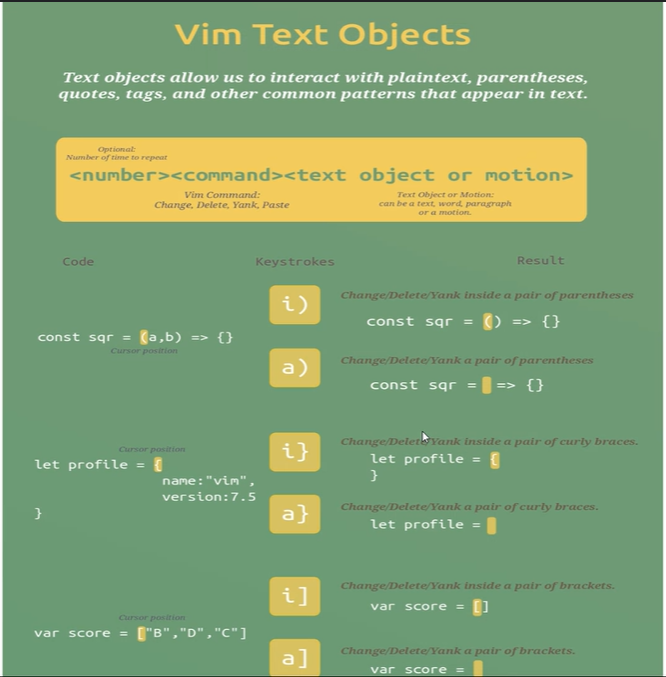

# Git vs Git Hub
Git | Git Hub |
---| ----|
Its an actual s/w | Its a place to store files
Its the VCS | bitbucket, gitlab are similar to github
Its an offline s/w | It cannot work without internet

## Git Fundamentals
Pushing the code through command line
1. git init -> To initialize a repository
2. git add path -> To stage the changes
3. git status -> To check the file's current state
4. git commit -m "message" -> savepoint with a message
5. git log -> To Track the commits
To exit from git log press 'q'
6. git checkout hashvalue - to jump to particular commit
7. git checkout - --> it brings back to the previous head pointing commit
8. git switch - -> Switch to the master branch
8. git checkout master -> To bring back to recent commit

### Git Log
1. git log -> to see commits
2. git log -n -> n number of recent commits will be shown  
Filters
- --author==`<pattern>`
- -n `<n is number>`
3. git log -p -> patch (What code added or deleted), which lines modified in the files
4. git log -S -> pick-axe command
5. git log -S -p -> to track through the specific functions 
    - `/<word>` - Highlight search
    - `<space>` - Page down
    - `n` - Next match
    - `N` - Prev match
6. git log --graph -> To visualise 
### COMMIT
1. Why Commit is needed?
    - When there is logical change
2. Small Commits should made
3. Message should be proper

### Git Merge Flow

## VIM
Vim is an editor which will only open in git bash command line
- How to open vim?
> vim filename
- Shortcut in vim
> verb + number + movement
// VIM tutor & Vim games
### Different verbs in VIM
1. Move up - k
2. MOve down - j
3. Move left - h
4. Move right - l
5. Delete - d
    - Delete one word - d + 1 (Where you want to delete a word)
    - Delete multiple words - d + n (n words are deleted)
    - Delete a line - d + d
    - Delete a para - d + ip (inside para)
    - Delete a selected word - d + iw (inside word)
    - Delete characters till a particular char - d + char(ex:a,b,c)
6. Save - w
7. Exit - q
    - Force quit - q!
8. To repeat recent command - .
9. Select - v (Visual Select)
10. Inside - i
11. Around - a
12. Cut - x
13. Copy - y (Yank)
    - Copy entire line - yy

